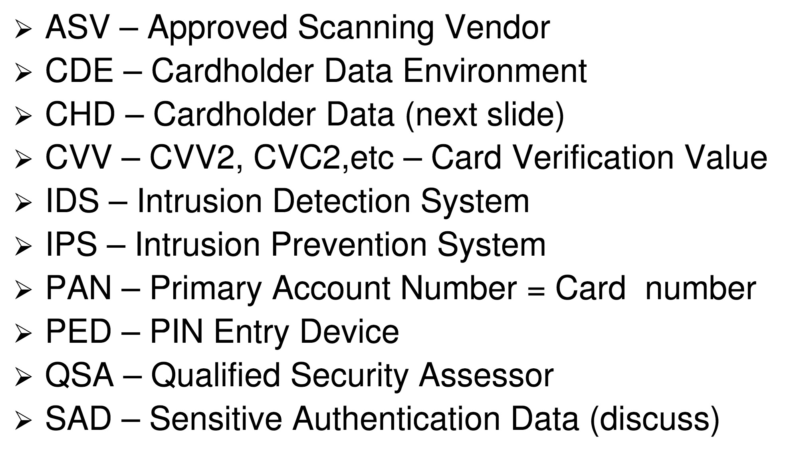
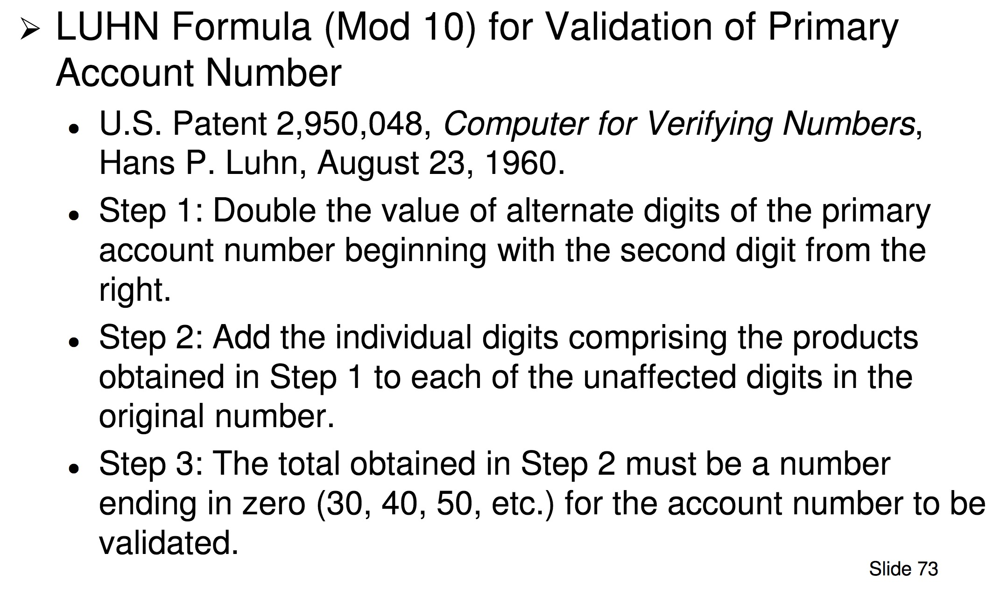

# Week 12: Payment Card Industry and Cloud Computing Security

## Card Track Information
- Payment cards use two tracks of data on the magnetic stripe:
    - Track 1:
        - Contains all fields of both track 1 and track 2
        - Length up to 79 characters, 7 bits per character, 210 bits per inch
    - Track 2:
        - Provides shorter processing time for older dial-up transmissions
        - Length up to 40 characters, 5 bits per character, 75 bits per inch

## EMV Chip Cards
- Prevents criminals from producing cloned magnetic strip cards

\ 

## Payment Card Operations

### Authorisation
1. Cardholder swipes card at merchants
2. Acquirer asks payment brand network to determine issuer
3. Payment brand network determines issuer and requests approval for purchase
4. Issuer approves purchase
5. Payment brand network sends approval to acquirer
6. Acquirer sends approval to merchant
7. Cardholder completes purchase and receives receipt

### Clearing
1. Acquirer sends purchase information to the payment brand network
2. Payment brand network sends purchase information to issuer, which prepares data for cardholder's statement
3. Payment brand network provides complete reconciliation to acquirer

### Settlement
1. Issuer determines acquirer via the payment network brand
2. Issuer sends payment to acquirer
3. Acquirer pays merchant for cardholder's purchase
4. Issuer bills cardholder

## Merchant Levels
- Merchant levels are defined by the payment brands
- Determined by the acquirer based on transactions
- Merchant may be on different levels for different brands
    - Discover, Mastercard and Visa define 4 levels
    - American Express defines 3 levels
    - JCB defines 2 levels
- Lower merchant levels are allowed to handle more transactions

## PCI Standard Requirements
1. Firewalls
2. Change Default Passwords
3. Protect Stored Data
4. Encrypt transmission of cardholder data across open, public networks
5. Use Anti Virus
6. Develop and Maintain security systems and applications
7. Restrict access to cardholder data by business need to know
8. Assign a unique ID to each person with computer access
9. Restrict physical access to cardholder data
10. Monitor and track all access to network resources and cardholder data
11. Regularly test security systems and processes
12. Maintain a policy that addresses information security

## Searching for PAN

\ 

