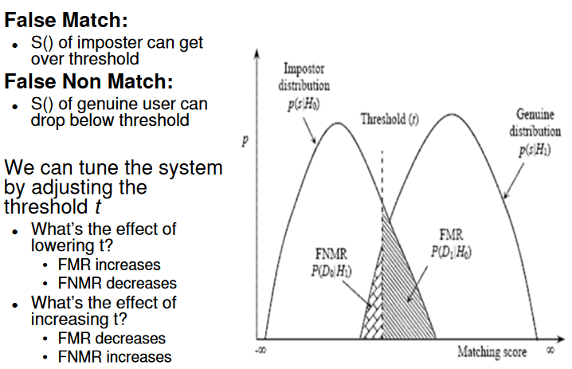

# Week 3: Authentication Protocols

## Password Based Authentication Protocols
- Authentication over the network (remote login, authentication to a web server)
- Most Basic:
    - Password Authentication Protocol (PAP) RFC1334

## Challenge Response Protocol
- Server gives client a "challenge", `c`
    - Often called 'nonce' (number used once)
- Client calculates a response, which is cryptographically one-way hash of `c` and password `p`
    - `r = h(c || p) or r = h(c XOR p)`
    - `||` means concatenation
    - Client sends `r` back to server
- Server can check calculation
- Eavesdropper can see `c` and `r`
    - But cannot derive `p`
    - Replay attack is not possible
- Implementation: Challenge Handshake Authentication Protocol (CHAP) RFC1994

## Choice of Challenge
- Consider a challenge response protocol where the server selects the challenge deterministically and predictably
- For example:
    - `c1 = 1`
    - `c2 = 2`
    - `c3 = 3`

- Response
    - `r = h(ci | p)`
- Does not affect the security
- The main requirement is that `c` is not being _reused_ (i.e. a nonce)
- The ability to predict `c` does not give an attacker an advantage

## Practical Examples

- HTTP (Hypertext Transfer Protocol)
    - Simple request/response protocol between web clients and servers
- HTTP provides a simple access control and authentication mechanism
    - Limit access to certain pages to specific users
- Defined in RFC2617
- Two types of authentication: "Basic" and "Digest"

## HTTP Basic Authentication
- Browser sends a 'GET' request to the web server
- Server responds:
    - "Not authorised for realm XYZ"
    - Require "Basic Authentication"
- Browser asks user for username and password for realm XYZ
    - pop-up window
- Browser sends a new GET request
    - "Please give me the file. Authentication details are:"
        - Basic Authentication, username:password
    - Server checks details and responds

- Problems:
    - Password sent in clear text, can be eavesdropped
    - Basic HTTP Authentication is NOT secure

## HTTP Digest Authentication
- Challenge response mechanism
    - Browser sends HTTP GET request
    - Server responds with nonce and other data
    - Browser prompts user for username and password
    - Browser calculates the has of:
        - (username, password, realm, nonce, URL)
    - This hash is sent back to the server, which verifies it

- Digest Authentication solves the most severe security problem of Basic Authentication
    - Password is never sent in cleartext
    - Replay attack not possible
- Limitations
    - Still password based
        - Plaintext password stored at server
    - Uses MD5 hash, which is considered broken
    - Vulnerable to Man in the Middle attacks
- OK for low security applications
- Should use the following for higher security:
    - TLS, HTTPS
    - Public Key Cryptography

## SSH Authentication
- RFC4252
- Supports several methods
    - Password
    - Public Key
- Password Authentication
    - SSH establishes an encrypted channel between client and server
    - Then, the password (not hash) is sent across the secure channel
    - Limitation:
        - Vulnerable to Man in the Middle attacks
        - Lack of authentication when establishing secure channel
- Public Key Authentication
    - Not vulnerable to Man in the middle attacks

## Lamports Hashed Password Scheme
- Application of cryptographic one-way hash function for secure authentication
- Idea: Create a sequence or chain of __one-time__ passwords using a __one-way__ hash function
- Used in "S/Key", defined in RFC1760 and RFC2289
- Vulnerable to man in the middle attack
- Once we run out of passwords, need to redistribute new ones

## Lamports Hash Password Example
- Client sends initial secret password `p0` (seed value)
- Compute sequence of hash values
    - `p1 = h(p0)`
    - `p2 = h(p1) = h(h(p0))`
    - `....`
- Store `p(n+1)` at server with counter `n`
- When user logs in, server sends `n` as a challenge
- User sends `pn`, server calculates `p(n+1) = h(pn)` and compares it with stored value `p(n+1)`
    - If correct, the user is authenticated
- Server decrements `n` by one
- Next time, the user needs to send the password higher up in the list
- Eavesdropper observing `pn` cannot compute `p(n-1)`, required for next authentication
    - One way nature of hash function
- No need to store password at the server

## Multi Factor Authentication
- Authentication: Based on something you are, know or have
- If a higher level of security is required, two of three mechanisms are combined. Most commonly, two factors are used
    - Two factor authentication
- Something you know __and__ something you are
    - Password and fingerprint
- Something you know __and__ something you have
    - Password and physical key
- Something you are __and__ something you have
    - Fingerprint and physical key

## Biometrics
- Biometrics comes from the Greek word _Bios_ (life) and _metrikos_ (measure)
- Authentication based on something you are
- Examples:
    - Fingerprints
    - Voice
    - Iris
    - Retina
    - Hand geometry
    - Gait
    - Signature
    - Face
    - DNA

## Criteria for Good Biometrics
- Universality
    - Each person should have the characteristic
    - e.g. Bald people do not have a hair colour
- Distinctiveness
    - Any two persons should be sufficient different in terms of this characteristic
    - e.g. Shoe size is not distinct
- Permanence
    - The characteristic should be sufficiently invariant over time
    - e.g. Hair colour changes
- Performance
    - Recognition speed
- Acceptability
    - Extent to which people are willing to accept the biometric in their daily live
- Circumvention
    - How easily the system can be tricked

## Enrolment
- A biometric system is a pattern recognition system
- User need to 'enrol'
    - Biometric data is 'scanned'
    - Features are extracted
        - Instead of storing the image of the fingerprint, only a "feature vector" describing the key characteristics are stored (highly compressed)
    - Feature Vector ('template') is stored in a database, together with identity of the user

## Verification and Identification Mode
- A biometric system can operation in two modes:
- __Verification Mode__
    - User Bob identifies himself, e.g. via a pin
    - Biometric is scanned and compared to Bob's template in the database
    - System answers the question: __Does this biometric betlong to Bob__
    - One to one match
- __Identification Mode__
    - User is not required to claim identity
    - System tried to answer the question: __Whose biometric is this__
    - One to N match
    - Much harder than verification mode

## Biometrics - Problems
- Two Main Types of Errors
    - False Accept (False Match)
        - e.g. Alice's biometric is wrongly matched to Bob's template and she gets access to the bank vault.
        - FAR: False Acceptance Rate (or probability)
        - FMR: False Match Rate (or probability)
    - False Reject (False Non-Match)
        - e.g. Bob's biometric is not matched to his template in the database and he is wrongly denied access
        - FRR: False Rejection Rate (or probability)
- In addition: Failure to Enrol (FTE)
    - Low quality input, which does not allow the creation of a valid template

## Errors in Biometrics
- Why can errors happen (e.g. Fingerprints)
    - Sensor Noise
    - Different characteristic of sensors
        - e.g. enrolment vs verification/identification
    - Dry fingers
    - Changes in user's physiology (bruises, cuts)
    - Ambient conditions, temperature, humidity
    - User interaction, finger placement
- Biometric measurements taken from the same person at different times are never exactly the same
- __Temporal Variations__: Changes over time
- __Sensor Interoperability__: Sensors have different characteristics, e.g. sensitivity

## Formal Description of the Verification Problem
- If the input feature vector and claimed identity is similar by a certain score, allow access, other reject

## Formal Description of the Identification Problem
- If the input feature vector and claimed identity is similar by a certain score for one of the enrolled users, allow access, otherwise reject

## Matching Score
- Scanned data and feature vector for the same person vary due to:
    - Sensor noise, ambient conditions, user interaction
    - These factors are to a large degree random
- The matching score `S()` for a particular measured feature vector and a given template can be modelled as a __random variable__
- (Continous) Random variables are defined through their Probability Density Function (PDF)

