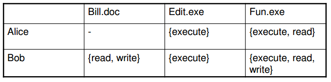

# Week 4 : Biometrics and Security Models

## Types of Biometrics

- Physiological biometrics
...

## Criteria for Good Biometrics

- Universality
- Distinctness
- Permanence
- Performance
- Acceptability
- Circumvention

## Matching Score
- Scanned data and feature vector for the same person vary due to:
    - Sensor noise, ambient conditions
    - These factors are to a large degree random
- The matching score can be modeled as a random variable anda  corresponding pdf
- The pdf can be determined through measurements
- The pdf of the matching score differs from genuine users and imposters

## FMR-FNMR  Tradeoff
- Different applications choose different operating points t, i.e. different FMR-FNMR tradeoff levels

## Choice of Systems
- No biometric system is perfect
- Trade off between characteristics

## Attacks on Biometric Authentication
- Possible attacks on face recognition
- Spoofing attack
    - e.g. Holding a picture up to a camera
- Replay attack
    - e.g. Record image then replay it

## Liveness Test
- Check if the thing being assessed is alive

## Computer Based Access Control

### Authentication
- We assume the user has been authentication
- How does an Operating System control access to resources (files, printers)
- Fundamental access control model:
    - Subject: active party
        - User, process
    - Object: passive party
        - file
    - Reference monitor: grants or denies access

### Access Control Policy
- Access Control Policy specifies what subjects can do with objects
- What are the basic operations that can be applied to objects
    - Read
    - Write
    - Execute
    - Append
    - Delete
- We define the following:
    - set S of subjects
    - set O of objects
    - set A of access operations

## Access Control Matrix

- Access Rights can be defined as a __Access Control Matrix__

- Access Control Policies are rarely implemented directly as Access Control Matrices
- Hard to maintain a large number of objects and subjects

## Access Control Lists (ACL)
- Access rights are stored as objects
- Columns of Access Control Matrix (including user names in first column)
- Advantage: Easy to see who has access to specific objects
- To revoke access to an individual user, need to search through the entire ACL, which is expensive
- Managing access rights of a large number of individual users (subjects) via ACLs can be tedious, there is a solution:
- Groups (or Roles)
    - Users (subjects) with similar access rights are aggregated in groups and access permissions are given to groups
    - Some policies allow membership to multiple groups, others not
    - Groups  can be defined according to roles
    - Access rights can be revoked by removing a user from the group

## Unix Access Control
- Traditional Unix systems provide a limited form of ACLs
- The owner of each file (and root) can specify
    - Access rights ("permissions") for the owner
    - Access rights for people in the same group
    - Access rights for everyone else ("other", "world")
- Each access right is a combination of:
    - `R` - allowed to read the file
    - `W` - allowed to write to the file
    - `X` - allowed to execute the file

## SUID
- Set User Id
- Allows a program to be ran with the owner's permissions, instead of the user
- If an attacker can gain control of a SUID program, then they can run programs as sudo

## Principle of Least Privilege
- Very important general principle in information security
- A process should give up super-user rights when they are no longer required

## Capabilities
- Capabilities are an alternative to ACLs for managing access rights
- A capability is an (objects - rights) pair
- Access rights are stored with subjects, rows of access control matrix
- Advantages:
    - Easy to see permissions for a individual user
    - Easy to revoke access for a particular user
- Disadvantages
    - Hard to see who has access to a particular object
    - Harder to revoke access to a particular object -> must find all tickets
- Rarely used in practical systems

## Types of Access Control - Ownership
- Discretionary Access Control (DAC) allows the user to specify who has access to to a file
- Mandatory Access Control (MAC) is a system wide policy that defines access

## Problems with DAC
- The user can grant anyone permission to the file, so if the user is tricked to give permission to file that could be a problem
- The problem is that programs and users cannot be trusted
- Users can be tricked with viruses, such as Trojans

## Mandatory Access Control
- Each file (object) has a __classification__
    - e.g. Secret, Top Secret
- Each user has a __clearance__
    - e.g. Secret, Top Secret
- A user can only access an object if his/her clearance is equal to or greater than the classification of the object
- Classifications and Clearances are assigned by the system/management. User has no discretion about who can access which information.

## Categories - Compartments
- Principle of Least Privilege
    - Users should only have access to the information they need
- e.g. Nuclear, Crypto

## Security Models

### Lattice Based Access Control Model
- An ordered sequence of sensitivity __levels__
- A set of __compartments__
- A "dominates" relation
- Nodes in a lattice consist of a sensitivity label and a set of compartments
- Example:
    - {secret, Nuclear}

### Bell LaPadula (BLP) Model
- A formal model of a security policy
- Each user has a clearance
- Each process operating on behalf of a user is a subject
- Each file is an object, and hence a classification
- BLP is concerned about confidentiality
- It tries to prevent information from leaking from a high level to a low level
- __Two rules to prevent information from flowing "downwards"__
    - __Simple Security Property__
        - A subject can only __read__ an object if its clearance dominates the object's classification
    - __*(star)-property__
        - A subject at a given security level must not write to any object at a lower security level

### High Water Mark
- Consider a subject with a secret clearance
- The subject has not accessed any files yet
    - No need to be at highest level
    - Its _current_ security level is unclassified
- This subject can write to an unclassified file
- The subject now reads a classified file
- Its current level increases to classified
    - It can no longer write to a unclassified file
- The security level of subjects can only __increase__
