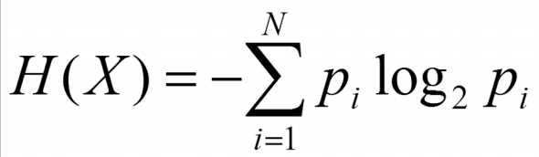
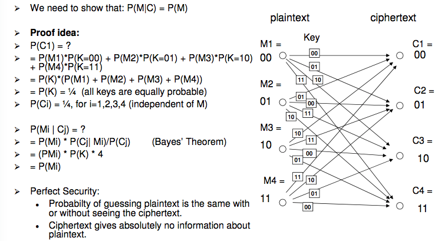

# Week 5: Information Theory

## Measure of Information
- The unit of information is _bits_
- `I(X)` is the average amount of information gained from observing the outcome of the random variable `X`
- `I(X)` is also the minimum average number of bits needed to encode all possible outcomes of `X`

## Entropy (Hartley Information)
- `I(X) = log(2) N` is the amount of information, where `N` is the number of combinations, this is the Hartley Equation
- The probability `p`for each of the `N` outcomes is `-log(2) p` or `log(2) 1/p`

## Coding
- Many methods of encoding, such as Huffman (Prefix free binary code)

## Measure of Information
- The weakness of the Hartley's definition of information is that it ignores the different probabilities of the outcomes
- Use the weighted average of Hartley Information
- Multiply `I(X)` with the probability of `X` happening
- `I(X) * P(X)`

## Shannon's Measure of Information
- The above can be simpified into a single equation:

\ 
- Shannon Information (Entropy) is the _weighted_ average of Hartley Information
- When all outcomes are equally likely, Hartly Information is the same as Shannon Information

## Binary Entropy Function

- If there are two outcomes (binary), with probabilities `p` and `(1 - p)`, the maximum Entropy/Uncertainty is if both outcomes are equally likely.
- In general, for a variable with `N` outcomes, we have maximum Entropy if all outcomes are __equally likely__

## Redundancy
- Using more bits for messages than their Entropy (absolute minimum) is called Redundancy
    - Redundancy is the difference between message length in bits and the Entropy
    - Reducing redundancy gives use compression
    - This is how gzip works
- Redundancy can be used to correct errors
- Less redundancy means less error tolerance

## Entropy of the English Lnaguage
- 26 letters
- If all letters are equally likely: `H(X) = log2(26) = 4.7 bits`
- With letter frequencies in english: `H(X) = 3.9 bits`

## Password Entropy
- Entropy is often used as a quality measure of passwords
- High Entropy means more random, more unpredictable, lower level of 'guessability'
- Password entropy does not only depend on the total number of possible passwords (N), but also their frequencies (probabilities)

## Introduction to Cryptography
- Cryptography
    - Literally 'secret writing'
    - Science and art of keeping messages secure
- Cryptanalysis
    - Science and art of breaking message security
- Cryptology
    - Science of secret communications (theory and mathematics) associated with cryptography and cryptanlysis

## Cryptography
- Primary Aim
    - __Confidentiality__: to allow a sender to transmit a message to a receiver, being sure that nobody else can read and understand the message
- Secondary Aims
    - __Authenticity__: To prevent an attacker from impersonating the sender
    - __Integrity__: To convince the receiver that the message has not been altered in
    - __Non-repudiation__: The sender cannot later deny having sent the message
- Terminology
    - Encryption of plaintext `P` is the ciphertext `C`
        - `C = E(P)`
    - The decryption of the ciphertext `C` is the plaintext `P`
        - `P = D(C)`
    - In general, we have the identity:
        - `P = D(E(P))`

## Cryptographic Algorithms (Ciphers)
- We have to ensure that only legitimate or authorised users are able to encrypt and decrypt
- A simple way to do this is to restrict knowledge of the algorithms to authorised individiuals
    - Keep Encryption/Decryption algorithm secret
- __Problem__
    - This would mean that for every different set of people who wanted to communicate, there would have to be a different algorithm
    - It becomes very impractical to keep using different algorithms, it is rather difficult to invent new ones which are resistant to cryptanlysis
    - If an encryption algorithm gets in the hand of an attacker, we need to invent a new algorithm

## Cryptographic Keys
- Modern algorithms are actually large classes of encryption and decryption functions
- The sender and receiver need to use corresponding functions
- The _index_ of the function is called the __key__
    - The function is parameterised by the key
- For __symmetric__ encryption algorithms the key is used for encryption and decryption functions
- Rather than having to keep the algorithms themselves secret, the security rests in the secrecy of the key

## Kerckhoffs' Principle
- _The security of a cipher should rely on the secrecy of the key only_
- Assumption: Attacker knows every detail of the cryptographic algorithm
- Rationale:
    - A determined attacke is generally able to obtain a blueprint of an encryption/decryption algorithm anyway, by clever deduction
    - Cryptographic history has demonstrated this many times over
- Alternative
    - Security through Obscurity
        - Considered bad practise
    - Security relies on keeping the design of the system secret

## Cryptographic Algorithms (Ciphers)
- Some algorithms use the _same_ key for encryption and decryption, these are called __symmetric algorithms__ or __secret key algorithms__

## Types of Attacks
- Goal of the attacker: Recover the plaintext or the key

- Attacks:
    - __Ciphertext only attacks__
        - Attacker knows ciphertext of several messages encrypted with the same key or several keys
    - __Known-plaintext attack__
        - Known ciphertext / plaintext pair of several messages
    - __Chosen-Plaintext attack__
        - Attacker can choose the plaintext that gets encrypted thereby potentially getting more information about the key
    - __Adaptive Chosen-Plaintext Attack__
        - Attacker can choose a series of plaintexts, basing the choice on the result of previous encryption

- Brute force attacks: Try every possible key

## Caesar Cipher
- The Caesar Cipher is an example of a __substitution cipher__
- Uses a shift of __3__ positions of the alphabet

## Monoalphabetic Substitution Cipher
- Instead of just shifting the alphabet, like Caesar cipher, we use any permutation
- For 26 letters, there are 4 * 10^26 potential keys

## Frequency Analysis
- Use __statistics__ to break a cipher, works good for Caesar cipher

## Vigenere Cipher
- Uses multiple alphabets
- Called a _polyalphabetic cipher_, uses multiple alphabets

## Breaking the Vigenere Cipher
- Look for repeated words in ciphertext
- Determine keylength
    - In Vigenere cipher with key length `n`, every n-th letter is encrypted with the same Caesar cipher
- Ways of determining the key length
    - Repetitions must have a distance that is a multiple of the key length

## Kasiski Test
- Find repetitions of N-grams, N > 2
- Write down distances of repetitions
- Key length is likely to be the gcd (greatest common divisor) of these distances

## Transposition Cipher
- Instead of substituting letters, tranposition ciphers reorder them
- Write down plaintext on a piece of paper in horizontal rows of `c` characters each
- The ciphertext is read out vertically, column after column
- Transposition ciphers can be attacked with anagrams

## Perfect Security
- We consider a cipher to be __strong__ if the best attack against it is brute force
- Then, its security depends on the key length, the resources of the attacker and how long the information needs to be kept secret.
    - __Computational Security__

- __Perfect Security__
    - With unlimited time and computing resources, it is impossible to break
    - i.e. __One time pad__ and __Vernam Cipher__
    - Shannon provided a proof for this using Information Security

## One Time Pad (OTP)
- How it works:
    - For a plaintext message of _n_ bits choose _n_ random bits
        - The one time pad, only to be used once
    - Each bit is XORed with the corresponding bit of the random bit string -> Ciphertext
    - Encryption:
        - `Ci = Mi xor Ki`
    - Decryption:
        - `Mi = Ci xor Ki`
- Security:
    - The ciphertext C does not reveal any information about the message M, in an information theorectic sense
    - An attacker has the same chance of guessing the message with or without knowing the ciphertext
    - Shannon proofs that if `P(M|C) = P(M)`, an attacker gains 0 bits of information from observing the ciphertext
- Security proof:

\ 
- Brute force does not work against
