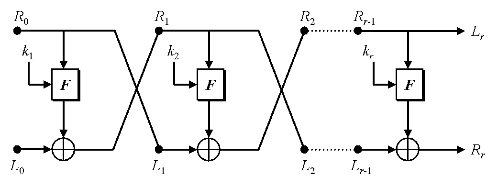
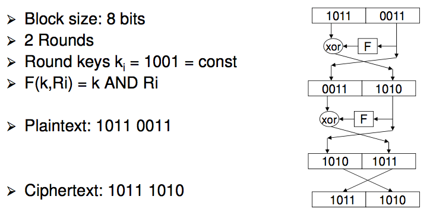
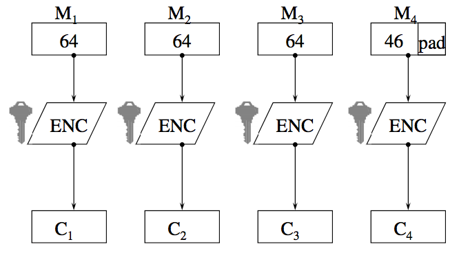
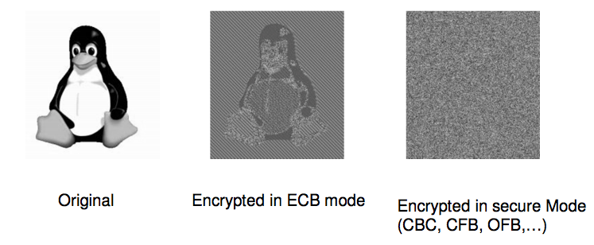
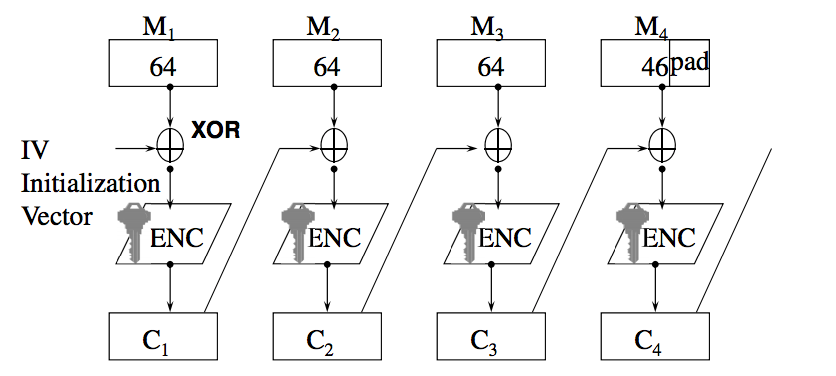
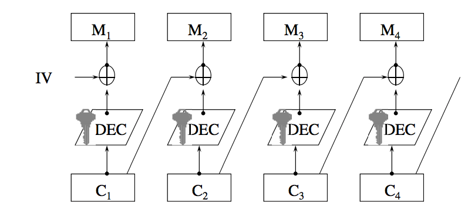
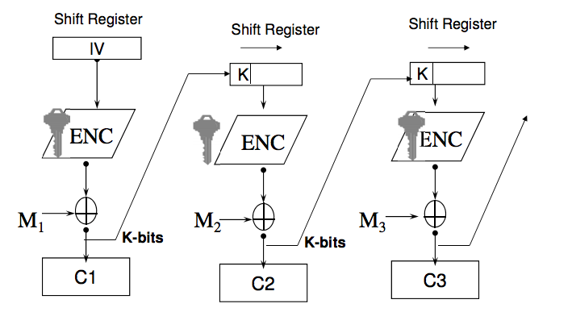
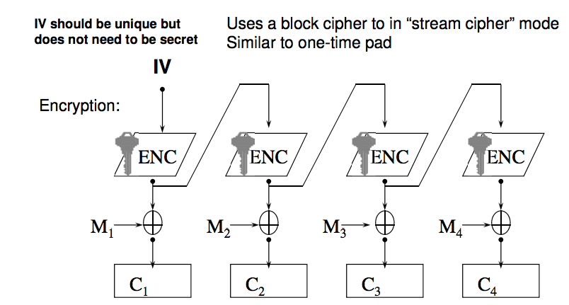

# Week 6: Symmetric Cryptography

## One Time Pads - Continued
- Downsides:
    - The key needs to be completely random
    - The keys need to be the same length as the message
    - Compared to AES, which has a key that can be used to encrypt an 'unlimited' amount of data

## Modern Ciphers
- Modern ciphers are often called Product Ciphers
- A product cipher is a composition of functions (ciphers) where each function may be a substitution or transposition
- 'Fiestel' Ciphers are a common class of product ciphers with a specific structure

## Feistel Cipher
- Combines substitution and transposition
- __Transposition__
    - Swapping of halves
- __Substitution__
    - Replacing left half with something else (Round function F)
        - Called `S-Box`
    - Choice of F determines security of cipher
        - F should be highly non linear
- Decryption is the same a encryption, but in reverse order of round keys
- Reversibility comes from structure. Function F does not have to be reversible

\ 

### Feistal Example

\ 

## DES (Data Encryption Standard
- Most widely used cipher for a long time
- NSA made some changes (probably backdoors)
- DES is a Feistel Cipher
    - 16 rounds
    - 64 bit blocks
    - 56 bit key (64 bit key less parity)
- Round function F(R, K)
    - Expand 32 to 48 bits
    - S-Box: 6-bit input to 4-bit output
    - Implemented by lookup tables
- No major weakness (break) has been found
    - Brute force attack is best option
    - Problem: 45-bit key is too short
- Security can be used by applying DES multiple times
- 2-DES is vulnerable to meet in the middle attack

## Designing a Cipher
- As much an Art as a Science
    - There is no guaranteed recipe for designing a secure cipher, some trial and error is involved
- Goal
    - Computational Security
    - Best attack option should be brute force
        - No shortcuts
        - Key length determines level of security
- Problem
    - It is not possible to prove that a cipher is secure against all possible types of attacks
- What can be done
    - Show that cipher is secure against all __currently known__ attacks
    - If, after intense scrutiny of the world's best cryptographers, no weakness is found, we can have some level of confidence that the cipher is secure
    - But this is no guarantee. Tomorrow, someone might come up with a new kind of attack

## Advanced Encryption Standard (AES)
- In 2000, NIST chooses new cipher as AES
- Known as 'Rijndael'
    - Symmetric block cipher
    - Not a Feistel cipher
    - Data blocks of 128 bits
    - Cipher keys with lengths of 128, 192, 256 bits
    - Designed to handle additional block sizes and key lengths
- Some modern CPUs have specific instruction sets for AES

## AES in a Nutshell
- Substitution-Permutation (Transposition Network)
- Number of Rounds
    - 128-bit key: 10 rounds
        - fastest
    - 191-bit key: 12 rounds
    - 256-bit key: 14 rounds
        - slowest
- Operations are on a matrix of 4x4 bytes (128 bits) called the 'state'

## AES - High Level Steps
- Initial Round:
    - AddRoundKey
        - Every byte of 'state' combined with round key, using bitwise XOR
- Normal Rounds:
    - SubBytes - A non linear substitution step
    - ShiftRows - A transposition step
    - MixColumns - A linear transformation on columns
    - AddRoundKey - Combine with round key
        - Same as initial round
- Final Round
    - Same as normal round, but no MixColumns step

## AES Operation
- Choice of transformations such as S-box and permutations in AES are carefully chosen based on mathematical properties of computation in 'Finite Fields' or 'Galois Fields'

## Side Channel Attacks
- Attack on the implementation of a cipher, and not the algorithm itself
- Uses information gained from the physical implementation of a cryptosystem, such as timing information, power consumption
- AES implementations have been broken using Side Channel attacks

## Block Ciphers vs Stream Ciphers
- __Block Cipher__
    - Works on fixed-size plaintext blocks (64 bits, 128 bits) and produces blocks of ciphertext of the same size
    - Most common ciphers today are block ciphers
- __Stream Cipher__
    - Works on smaller units of plaintext (bits or bytes)
    - Generates _pseudorandom_ key stream
    - Encryption is typically done via XOR-ing key stream
        - Similar to one-time pad, only that key stream is not truly random here
    - Key stream is typically generated via feedback mechanism using shift registers

## Stream Ciphers
- Works like a one time pad
- Generate pseudorandom key stream `S`
    - S is a function of a secret key `k`
    - Expand `k` into a arbitary long key stream
- Encryption: `C = P xor S`
- Decryption: `P = C xor S`
- No perfect security since key stream S is not truly random and will eventually be repeated

## RC4
- Stream cipher, very simple but has some vulnerabilities
- RC4 based cryptosystems
    - WEP
    - TKIP
    - BitTorrent Protocol Encryption
    - Microsoft Point to Point encryption
    - Secure shell
    - RDP
    - PDF

## Encryption Modes of Block Ciphers

## Electronic Code Book Mode (ECB)

\ 

- Weaknesses
    - The same plaintext block always results in the same ciphertext block (no dependencies between blocks)
    - Replay attack
    - Ciphertext can be reordered -> reordered plaintext
    - Dictionary Attack
        - Build a dictionary of all plaintext-ciphertext block pairs
        - Not feasible for large block size

\ 

## ECB Summary
- Advantages
    - Simple
    - Fast implementation
    - Error propagation
        - A bit error only affects a single block

- Problems:
    - Vulnerable to insertion, replay, reordering, dictionary attacks
    - ECB is not considered secure and should not be used

## Solution to ECB
- Feedback mechanism
    - The result of the encryption of a previous block is fed back into the encryption of the current block
    - Ciphertext blocks depend on plaintext block but also on previous ciphertext blocks
    - Different ways to use feedback
        - CBC
        - CFB
        - OFB

## Initialisation Vector

- IV does not need to be secret
    - Just a dummy ciphertext block to start with
- IV should be changed frequently
    - Encrypting the same plaintext with the same key and same IV still results in the same ciphertext

## CBC

- Encryption:

\ 

- Decryption

- Each block of ciphertext depends on current plaintext block, previous plaintext block and IV
- Prevents:
    - Reordering attacks
    - Insertion attacks
    - Replay attacks
    - Dictionary attacks

- Error Propagation
    - Loss of a complete ciphertext block
        - Results in only one plaintext block being garbled. CBC re-synchronises after that
    - Bit error in a ciphertext block
        - Results in the corresponding plaintext block being garbled
        - The next plaintext block has a single bit error at the same position as the bit error in the corresponding ciphertext block
        - Attacker could use this to achieve predictable bit changes in plaintext blocks
        - Further plaintext blocks are not affected
    - CBC is self recovering from bit errors

- Implementation
    - Must encrypt/decrypt each block in serial, not parallelisable
- CBC is the most commonly used cipher mode
- Is supported by all IPsec and TLS/SSL implementations

## Cipher Feedback Mode (CFB)

\ 

- CFB Error Propagation
    - Q: For a block size of 64 bits and k=8, how many blocks of plaintext are affected by a single bit error in the ciphertext
    - A: 9 (the current block plus the 8 following blocks)
        - It takes 64/8=8 times for the erroneous bit to fall off the other end of the shift register

- CFB Syncronisation
    - CFB can recover from whole blocks being deleted from ciphertext stream
        - Int the same way it handles bit errors
        - Self-syncronising at block level, similar to CBC

## Output Feedback Mode (OFB)

- Advantages
    - No error propagation (or error extension) as in CBC
        - 1 bit error in ciphertext -> 1 bit error in plaintext
        - Useful for voice and video for example
    - Allows pre-computing of psuedo random stream
    - XOR can be implemented very efficiently
        - Works like a Stream Cipher
    - Does not need a full block to start encryption
        - Useful for terminal applications
- Problems
    - Not self-synchronising
        - Cannot recover from loss of entire ciphertext blocks
