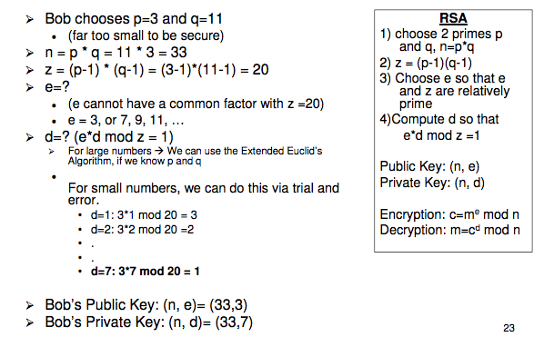
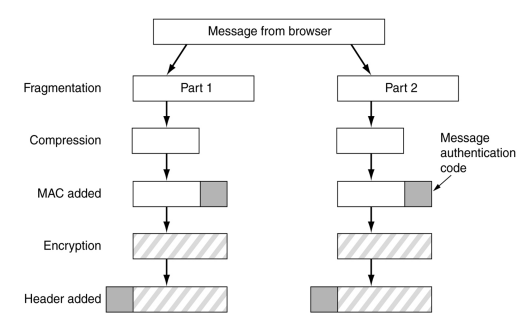
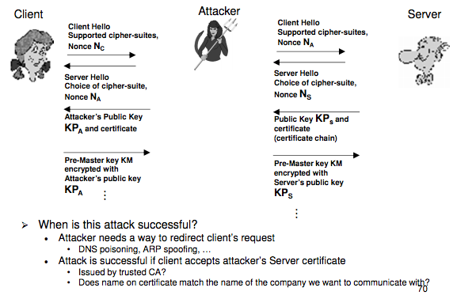

# Week 7: Asymmetric Cryptography

## Public Key Cryptography
- Main Idea:
    - Encryption key != Decryption key
    - Can make the encryption key public
    - Solves key distribution issues

## Modular Exponentiation
- `(g^x)^y = (g^y)^x = g^(xy)`

## Discrete Logarithm
- The inverse of modular exponentiation is the __Discrete Logarithm__
- `7^4 (mod 9) = 7`
- `log_7 7 (mod 9) = 4`
- Under certain conditions, it is guaranteed that the discrete logarithm `log_a c mod 9` has a unique solution for all `c`
    - `n` needs to be a prime number
    - `a` needs to be a _generator_
        - `a` is a generator if by computing `a^b` for all `b = {1, 2... n-1}` are _generated_

- Computation:
    - No efficient algorithm is known to compute discrete logarithms for large `n`
    - Modular exponentiation is a one way function

## Man in the Middle Attack
- Messages between Alice and Bob are not authenticated
- An active attacker can pretend to be Alice to Box, and can pretend to be Bob to Alice
- Problem: Lack of authentication

## RSA
- The Diffie Hellman protocol allows the establishment of shared secret keys, but is not a public key encryption algorithm
    - The 'Discrete logarithm' problem provides us with a one-way function, but not a __trapdoor one-way function__ ("mathematical padlock")
- First (publicly known) Public Key Cipher

## RSA - How it works
- We use modular arithmetic, `mod n`
    - `n` is called the __modulus__
- Bob chooses two large (> 100 digits) primes `p` and `q` and computes
    - `n = p * q`
- Bob computes `z = (p - 1) * (q - 1)` (Euler's Totient Function)
- Bob chooses exponent `e` that has no common factor with `z`
    - `z` and `e` are relatively prime (`gcd(e, z) = 1`)
- Bob keeps `p` and `q` secret, but sends Alice `(n, e)`
    - `(n, e)` is Bob's public key
- Alice can encrypt a message `m` as follows:
    - `c = m^e mod n` (Modular exponentiation is easy)
- Bob computes `d` such that `c^d = m mod n`
- `c^d = (m^e)^d mod n = m^(ed) mod n = m`
- `d` is the secret key that allows decryption (trapdoor)

## RSA Decryption - Finding __d__
- Problem: How does Bob find the secret key `d` that allows decryption:
    - `(m^e)^d mod n = m`
- We can find `d` if the prime factors `p` and `q` of `n` are known
    - Find `d` such that `e * d mod z = 1, z = (p-1)(q-1)`
    - An efficient algorithm for this is called __Extended Euclid's Algorithm__
- There is no known efficient way to find `d` for large `n` without knowing `p` and `q`, the prime factors of `n`
    - Factoring is considered a hard problem, in the same way as computing discrete logarithms is considered a hard problem
- There is no known efficient way to invert the encryption `m^e mod n`, without a trapdoor `d`
- Bob can now discard `p` and `q`, but must not reveal them
- Exponentiation `m^e mod n` is a trapdoor one way function with `d` being a trapdoor

## RSA Security
- It has been proven that breaking RSA is equivalent of solving the age-old factoring problem
- This is not impossible, but unlikely, given not just cryptographers, but also mathematicians have tried unsuccessfully for centuries to solve this problem

## RSA Key Length
- 1024 bit RSA key is equivalent in strength to 80 bit key of symmetric cipher
    - Don't need to brute-force 1024 key spaces as in AES, need to factor 1024 bit integer, which is still hard, but not as hard as brute forcing a 128 bit key.
    - 768 bit RSA keys have been broken
- 2048 bit RSA ~ 112 bit symmetric key
- 3072 bit RSA ~ 128 bit symmetric key

## Elliptic Curve Cryptography (ECC)
- Public key cryptography on special mathematical structure called Elliptic Curves
- Benefits:
    - Best know algorithms for computing discrete logarithms or factoring in ECC are much slower
    - Can achieve same level of security with shorter key length, compared to standard RSA

## Public Key Cryptography
- Public Key Cryptography solves the key distribution problem, but:
- Public Key encryption/decryption is orders of magnitudes slower than symmetric key cryptography
    - Modular exponentiation with very large numbers is significantly more expensive than the type of operations used in symmetric ciphers
- Hybrid Solutions:
    - Public Key Cryptography is only used to establish symmetric secret 'sessions keys'
    - For example, Alice could encrypt a 128 bit AES key with Bob's public key (signed with her private key)
    - Used in protocols such as TLS (and previously SSL)

## RSA - Interesting Properties
- Encryption and decryption are essentially the same operation and can be applied in any order
- `(m^e)^d mod n = (m^d)^e mod n = x^(ed) mod n`
- For example, Bob could encrypt with his private key and Alice could decrypt with Bob's public key

## RSA Signatures
- If you want to digitally sign a large document, you would use a hash function and encrypt the __hash function__ instead of the whole file using RSA encryption

## Public Key Cryptography - Overview
- Can be used for Confidentiality
- Can be used for Authenticity/Integrity
- Makes key distribution easier

## Authenticity of Public Keys
- Way to ensure public keys are authentic
- One way to do it is using Public Key Certificates

## Public Key Certificates
- Find someone trustworthy to verify a public key
- Public Key Certificate Chains
    - Public Key Certificate
        - __ Links together Identity and Public Key__
    - Signed by a trusted third party, called a __Certificate Authority__ or __CA__
    - CAs can have a hierarchical structure
    - Certificate Chains
    - At the top is the _Root Certificate_
        - self signed
        - Serves as a _trust anchor_
        - Trust is provided by other means, usually bootstrapped with browsers

## X.509 Certificates
- Public key certificate standard issued by ITU-T
- RFC5280

### X.509 Certificates
* Certificate
    * Version Number
    * Serial Number
    * Signature Algorithm ID
    * Issuer Name
    * Validity period
        * Not Before
        * Not After
    *Subject name
    * Subject Public Key Info
        * Public Key Algorithm
        * Subject Public Key
    * Issuer Unique Identifier (optional)
    * Subject Unique Identifier (optional)
    * Extensions (optional)
        * ...
* Certificate Signature Algorithm
* Certificate Signature

## What do Certificate Authorities do?
- CAs publish details of the identity verification process in a document called the __Certification Practise Statement__
- CAs generally have different levels of identity checking
- Extended Validation Certificate (EV)
    - More expensive and rigorous

## CRL
- CRL Distribution point
- A list of certificates that have been revoked

## Public Key Infrastructure
- All things you need to make public key cryptography work
- Key components:
    - Certificates
    - Certification Authorities
    - Certificate Revocation Lists

## MAC (Message Authentication Code)
- Basic idea: computers a checksum of the message
- `MAC = h(K || m)`

## HMAC (Keyed Hashing for Message Authentication)
- `HMAC(K, m) = H((K xor opad) || H((K xor ipad) || m))`

## SSL/TLS
- Secure Socket Layer
- Goal: Provide Key Establishment, Authentication, Integrity and Confidentiality of communication between web browser and server
- SSL has been adopted by the IETF as a standard
    - They called it Transport Layer Security (TLS)

## TLS
- Sits between the application and reliable transport layer (TCP)
- Can be used for any application
- TLS Consists of:
    - Handshake Protocol
        - Establishes shared secret key, negotiates cipher suite
    - Cipher Change protocol
        - Enables cipher change
    - Alert protocol
        - Reports errors
    - Record protocol
        - Main part, provides secure tranport

## TLS Record Protocol

## TLS Handshake
- Purpose:
    - Negotiate cipher suite to be used
    - Mutual Authentication of server and client
    - Establish shared secret keys for encryption and authentication and MAC
    - After the handshake, all data is sent via the TLS connection is encrypted and integrity is provided via HMAC

## SSL MITM Attack

