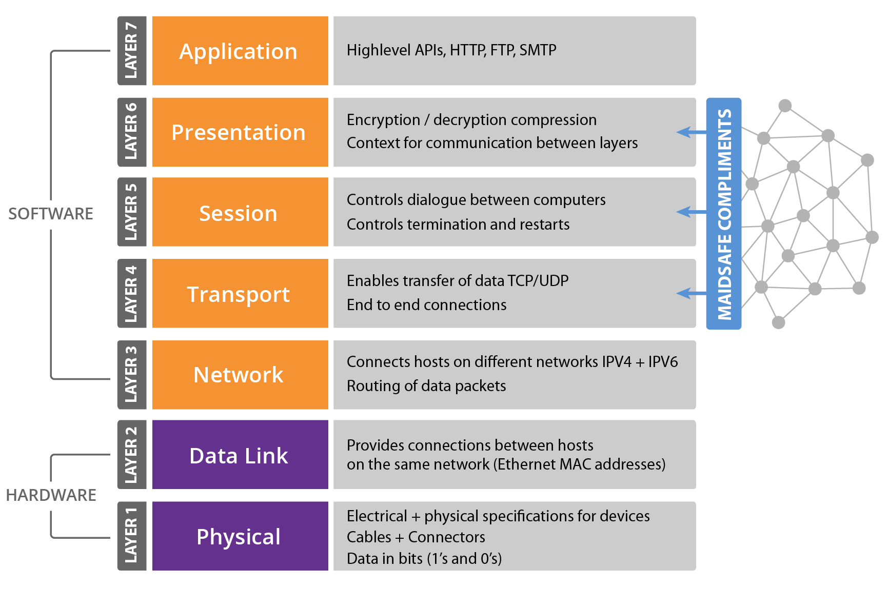
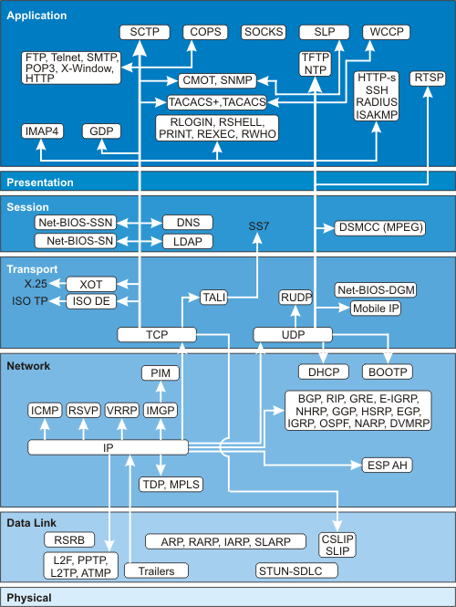
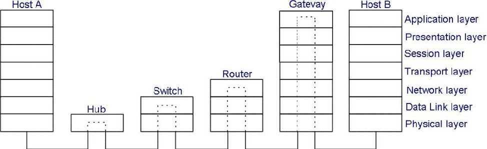
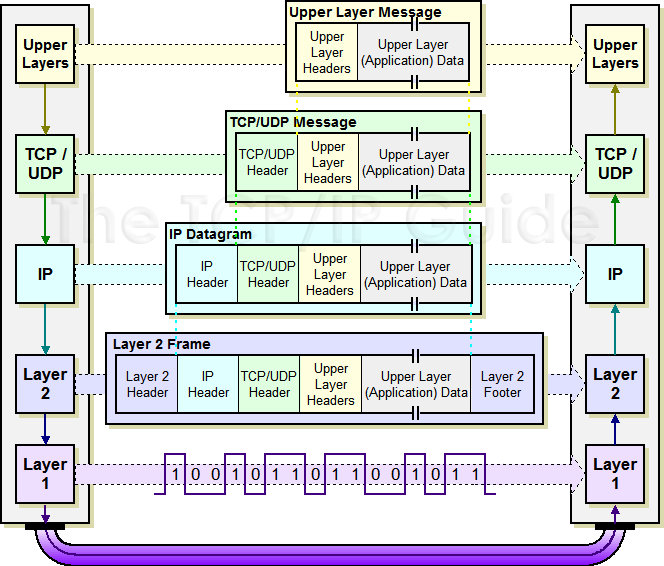

# Week 8: Network Security

## OSI Model

\ 

## Networking Components

\ 

## Layers and Devices

\ 

## TCP/IP Encapsulation

\ 

## Physical Layer Security
- Wired/UTP/Fibre
    - Access to jacks
    - Access to wires
    - Patch panels
- Wireless
    - Access to jacks (the air)
    - Access to wires (the air)
    - Patch panels (the air)

## Confidentiality
- Access to the medium
- Medium Accessed
    - Just volts on the wire
    - Packet sniffing
    - Promiscuous mode interfaces

## Data Link Layer Security
- Circuit switched networks
- Packet Switched Networks
    - IEEE 802 standards divide DLL into 2 sub layers
        - Logical Link Control (LLC) layer
        - Media Access Control  (MAC) layer

## Media Access Control
- Carrier Sense Multiple Access
- CSMA/Collision Avoidance (CSMA/CA)
- CSMA/Collision Detection (CSMA/CD)

## Network Layer Security
- Routers
- ACLs
- Stateful Packet Inspection
