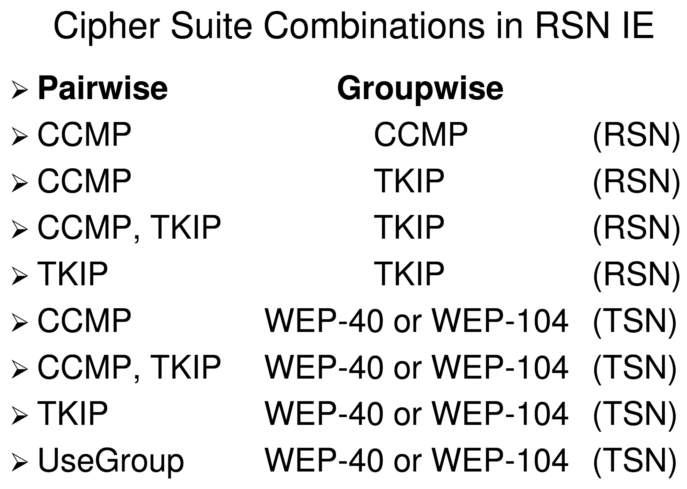

# Week 9: Wireless Network Security

## Network Layer Security
- Perimeter Security
- DMZs
- Segmentation
- Physical Security
- Intrusion Detection
- Incident Response
- Business Continuity
- Disaster Recovery

## Network Security
- Firewall at each Internet Connection and between any DMZ and the internal zones
- Current diagram that identifies all connections, including wireless networks
- Changes to Network connections
- Changes to firewall and router configurations
- Groups, roles and responsibilities for management of network components
- Firewall and router configuration standards
- Business justification for use of all services, protocols and ports allowed
- Identify insecure services, protocols and ports allowed
- Documentation of security features implemented for those protocols considered to be insecure
- Restrict inbound and outbound traffic to that which is necessary
- __Specifically deny all other traffic__
- Implement a DMZ to limit inbound traffic to only components that provide authorised publicly accessible services
- Secure and synchronize router configuration files
- Review firewall and router rule sets at least every six months

## Business Continuity and Disaster Recovery
- __Disaster Recovery__: Goal is to minimise the effects of a disaster and take the necessary steps to ensure that the resources, personnel and business processes are able to resume operations in a timely manner.

- __Business Continuity Planning__: Provides methods and procedures for dealing with longer term outages and disasters

- _Remember__: Although _availability_ may have been compromised, _integrity_ and _confidentiality_ must continue to be maintained.

## Business Continuity Steps
1. Business Impact Analysis
2. Recovery Strategy
3. Plan design and development
4. Implementation
5. Testing
6. Continual Maintenance

## Business Impact Analysis
- A BIA is considered a _functional analysis_, in which the team collects data through:
    - Interview
    - Documentation
    - Documenting business functions, processes, interfaces and transactions
    - Developing a hierarchy of business functions
    - Apply a classification scheme to indicate a particular function's criticality level
    - Usually will leverage off __existing Risk and Threat Management processes__

- Primary Characteristics include:
    - Maximum tolerable downtime
    - Operational disruption and productivity
    - Financial considerations
    - Regulatory responsibilities
    - Reputational damage

## BIA Processes
- Malicious internal users
- Natural disasters
- Equipment malfunction
- Failed facilities (HVAC, power, comms)
- Facility or critical personnel become unavailable
- Vendor or service providers become unavailable
- Software/data corruption (includes EMI in comms)

- _Maximum Tolerable Downtime_ (__MTD__) 
    - Outage time that can be endured by a company. Can vary based on threat (i.e. reputation damage from a technology issue might be far greater than natural disaster)
    - Examples:
        - Critical - Minutes
        - Urgent - 24 hours
        - Important - 72 hours
        - Normal - 7 days
        - Non-Essential - 30 days

## Preventive Measures
- Should be implemented when there is a realisable cost/benefit, e.g.
    - Facility fortification
    - Redundancy (servers, comms supplies)
    - Power connections from different transformers
    - Insurance
    - Fire detection and suppression solutions
    - Backup infrastructure

## Recovery Strategies
- What needs to be done to recover specified resources within the time-frames determined during the BIA process
- Cost/benefit analysis based on outage costs vs recovery costs
- Differs from _Preventative Measures_ because it focuses on what to do __after__ an event occurs, rather than to minimise the impact when it does occur
- Broken down into the following:
    - Business Process Recovery
    - Facility Recovery
    - Supply and Technology Recovery
    - User Environment Recovery
    - Data Recovery

## Data Backup Alternatives
- Full backup - one step backup or recovery - time intensive
- Differential - normally used with a full backup providing the base - 2 step recovery
- Incremental - smaller backups, but requires all past incremental updates to restore

## Electronic Backup Solutions
- Disk shadowing (similar to disk mirroring), expensive
- Electronic vaulting and remote journaling are alternatives:
    - Vaulting is not real time, with updated files being backed up off site in batches
    - Remote journaling is a method of transmitting transaction logs off-site, not the actual files, this is efficient for data recovery

## Recovery and Restoration Criteria
- Danger to human life
- Danger to state or national security (CI)
- Damage to facility
- Damage to critical systems
- Estimated downtime that will be experienced

## Reconstitution Phase
- Company is ready to move back into original site or a new site and needs to ensure:
    - Safety of employees
    - An adequate environment is provided
    - Necessary equipment and supplies are present
    - Proper communications and connectivity
    - That the environment has been properly tested

## Testing
- Checklist - Desk test
- Structured walk through - Representatives meet and review plan
- Simulation - A lot more planning and people
- Parallel test - Ensures that teams and equipment can handle critical processing at the alternate site
- Full interruption test - Not so common due to risk of business impact, but this is the most thorough way to test the plan

## IEEE 802.11 WLAN Security

- Allows devices to move about with freedom
- Both moveable and mobile devices
- Greater convenience
- Easy modification of networks
- Allows for networks in difficult locations

## WLAN Characteristics
- IEEE 802.11 WLAN inherent characteristics
- Electromagnetic broadcast technology
- You are transmitting to the universe
- Compromise __confidentiality__
- Fragile __availability__
- Threaten __integrity__

## Basic Service Set (BSS)
- Simple peer to peer, two clients

## Independent Basic Service Set (IBSS)
- Peer to peer, multiple devices

## Extended Service Set (ESS)
- Large network with routers, servers and firewalls
- Provides compartmentalisation

## IEEE 802.11
- Two physical interfaces
- Infra-red
    - Up to 2Mbps
- Radio
    - Up to 2Mbps in 2.4Ghz band

## IEEE 802.11 Standards


\ 

## IEEE 802.11b DSSS Channels


\ 

## 802.11a OFDM Channels
- 3 bands, only one is international ISM
- 2 lower bands are USA specific
- Upper band is 5.8Ghz ISM

- USA UNII Lower Band - 36, 40, 44, 48
- USA UNII Middle Band - 52, 56, 60, 64
- USA UNII Upper Band - 149, 153, 157, 161

## WLAN Threats
- Eavesdropping (loss of confidentiality)
- Masquerading and Resources Threat
- Traffic Redirection
    - Eavesdropping (confidentiality)
    - Tampering (integrity)
- Denial of Service
    - General DoS
    - Stealth DoS

## WLAN Security
- Service Set Identifier (SSID)
- MAC Address authentication
- Wired equivalent privacy (WEP)
    - One way authentication
    - Static WEP keys
    - Key size
    - Initialisation Vector (IV)

## Wired Equivalent Privacy (WEP)
- Part of IEEE 802.11
- Short Keys
- Static keys + short IVs = repeated keystream

## 802.11n MIMO
- `t x r : c`
- Number of transmit antennae
- Number of receive antennae
- Number of spatial antennae

## MAC Security

- Resolves confidentiality and integrity issues, including authentication, of all __data__ frames - management frames remain unprotected

## CCMP and TKIP
- Temporal Key Integrity Protocol (TKIP)
    - Legacy hardware for WEP
    - MIC called Michael
    - Per frame keying
- CCMP: AES in CTR mode, with CBC, with MAC (CCM)
    - New hardware
    - Stronger than TKIP

## Robust Security Network (RSN)
- Allows only the creation of robust security network associations
- 4-way handshake

```
STA: Computer, etc.
AP: Access point

AP -> STA: A-nonce
STA -> AP: S-nonce, MIC
AP -> STA: GTK, MIC
STA -> AP: Ack
```

- RSNA is optional, but if implemented:
    - A RSN only allows RSNAs

## RSN and TSN
- An AP in a RSN must not associate with pre-RSNA STAs
- AP must include a RSN IE in Beacon frames, showing group cipher CCMP or TKIP, but not WEP


\ 

## WPA (Wifi Protected Access)
- Snapshot of IEEE 802.11i/D3 draft
- Uses TKIP
- WPA Personal Mode offer only pre-shared key
- WPA Enterprise Mode offer both PSK and IEEE 802.11X/EAP Authentication

## WPA2
- Implements IEEE 802.11i but differs to allow for interoperability with WPA
- Available for both infrastructure mode and ad hoc
- WPA2 provides both TKIP and AES-CCMP
- A AP that allows WPA clients will be running a Transition Security Network (TSN)

# WPA vs WPA2
- WPA only certified for Infrastructure, not AdHoc
- In WPA, only TKIP is certified
- WPA2 must provide both TKIP and AES-CCMP
- WPA does not do PMK caching of pre authentication


\ 


\ 
