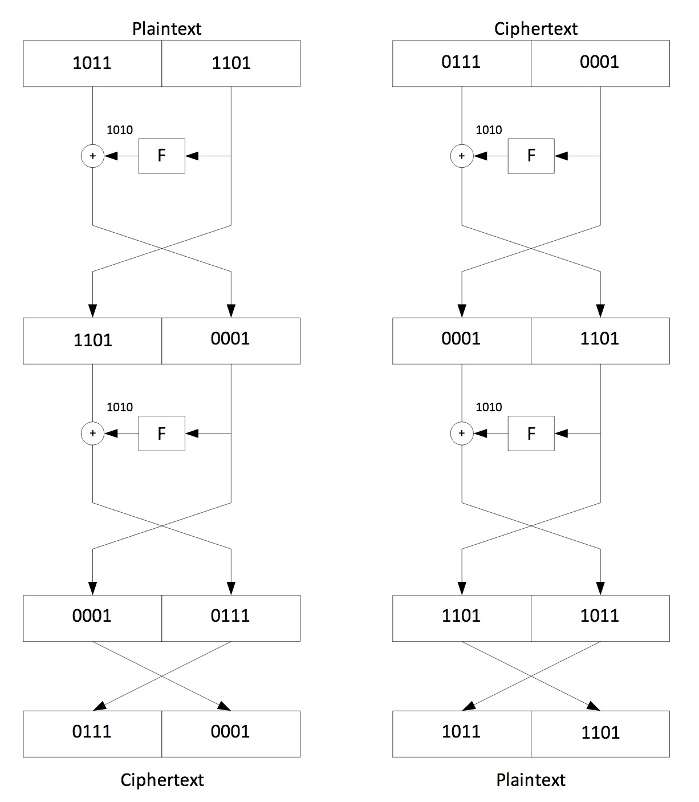

# Week 9 Tutorial: Feistal Cipher

Given is a Feistel Cipher with the following parameters:

```
8 bit blocks 
Ki=1010
F(Ri-1,Ki) = 1010 = const
```

Plaintext block: 10111101
Calculate the ciphertext using two rounds.
Decrypt the ciphertext by applying two Feistel rounds to the ciphertext. You should get the original plaintext.
Remember, at the end of each encryption and decryption process, the left and the right half are swapped one more time.


\ 
